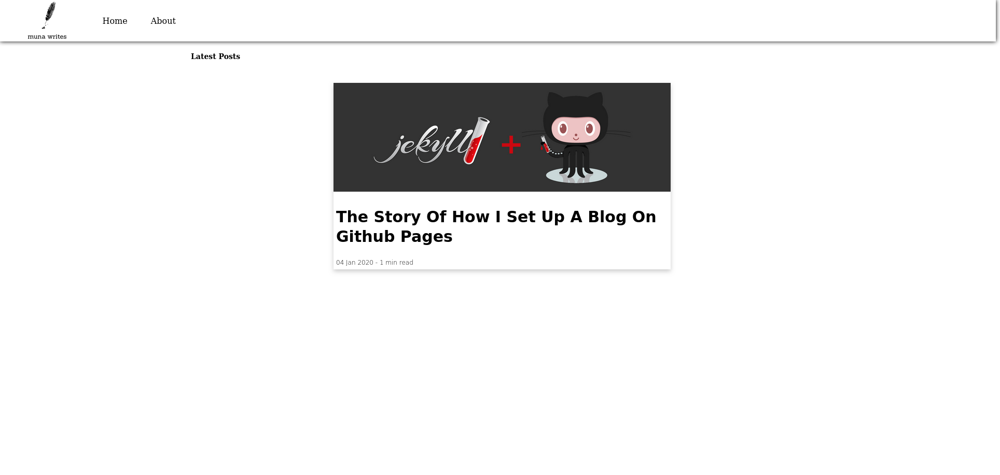
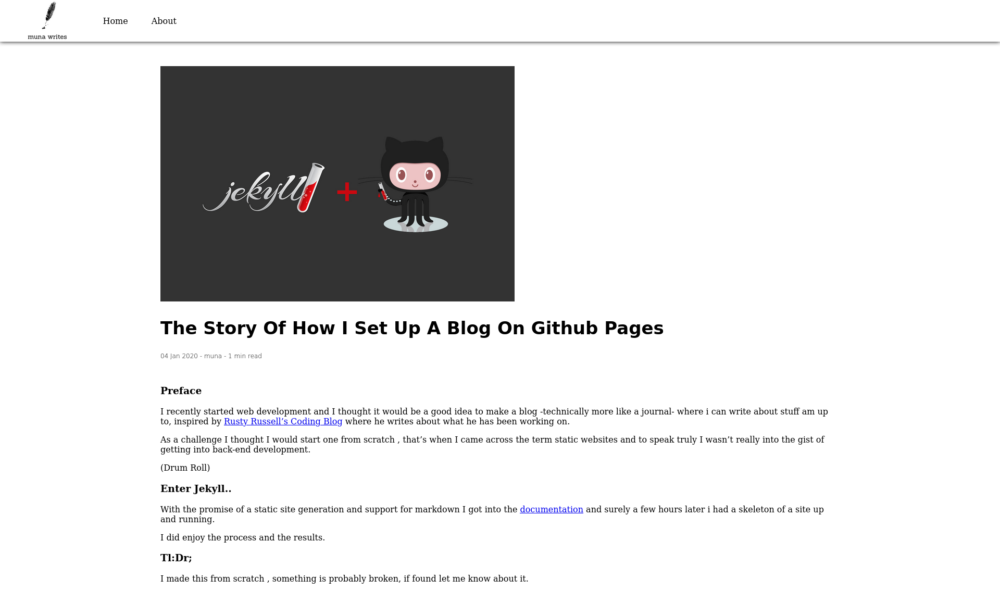
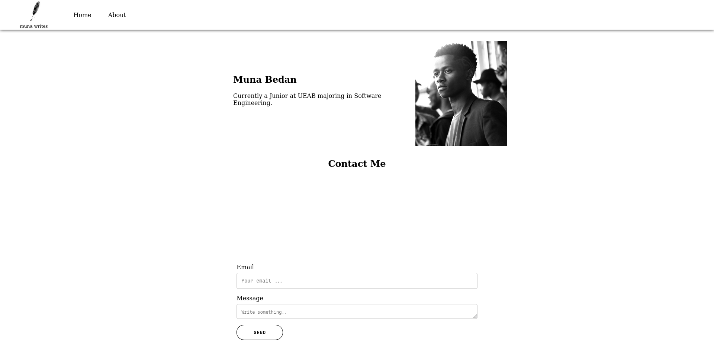

**Welcome to My Old Blog Repo**

This repository contains the source code and assets for my old blog website, built using Jekyll. Feel free to explore the code, use it as a reference, or even contribute if you'd like!

## Screenshots

Here are some screenshots of my old blog:

1.  - The homepage featuring recent posts and navigation.
2.  - A sample blog post page showcasing content and comments.
3.  - The about page introducing myself and the purpose of the blog.

## Installation

This  repo makes use of an old version of jekyll and ruby make use of the Docker file to create an image and run that.

## Contributing

If you'd like to contribute to this project, feel free to open a pull request or submit an issue. Your contributions are greatly appreciated!

## License

This project is licensed under the MIT License - see the [LICENSE](LICENSE) file for details.

